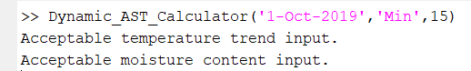
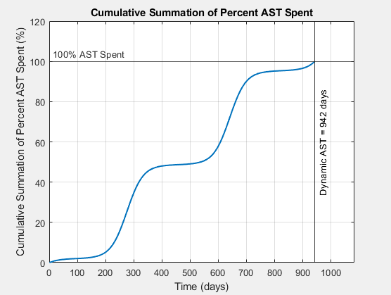
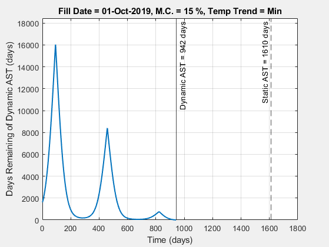
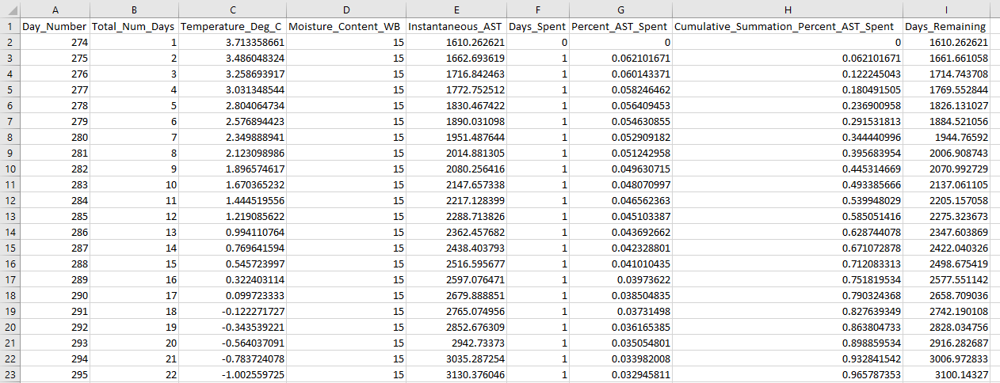

## _Introduction_

This repository serves as a storage location for a function that supports the following research paper: **"Simulating the Influence of Temperature Variation on Allowable Storage Time of Shelled Corn"**.  This function is labeled "Dynamic_AST_Calculator.m", and it adds a level of automation to simulating dynamic allowable storage time (AST) and visualizing dynamic AST data through plots.  This function is intended to be relatively straightforward and user-friendly.

## _How to use the Dynamic_AST_Calculator.m Function_

In order to utilize this function, only three inputs must be sequentially specified by the user: bin fill date, minimum or maximum temperature trend, and moisture content (% wet basis).  These three inputs are expressed as "Input_Date", "Input_Temp_Trend", and "Input_Moisture_Content" variables in the first line of the function.  
 
   - "Input_Date" needs to be specified as a string variable and can be any date throughout the year
   - "Input_Temp_Trend" needs to be specified as a string variable in the form of 'Min' or 'Max'
   - "Input_Moisture_Content" needs to be specified as a numeric variable and can be any reasonable shelled corn moisture content (% wet basis)

An example of how to use this function at a command line is shown below:

If the specified temperature trend and moisture content inputs are valid, then acceptance messages will automatically display as the function is simulating the dynamic AST response.

## _Outputs of Function_

This function outputs a summary excel file of important dynamic AST data to the local file directory along with two separate figures.  The first figure depicts the cumulative summation of percent AST spent, whereas the second figure depicts the days remaining of dynamic AST.

**Figure 1 Example Output**

**Figure 2 Example Output**

**Excel File Example Output**

## _Conclusion_

This function helps understand how dynamic AST is altered through three inputs: bin fill date, minimum or maximum temperature trend, and moisture content (% wet basis).  By experimenting with these variables, any user can simulate different scenarios and analyze how each input transforms the dynamic AST response.
